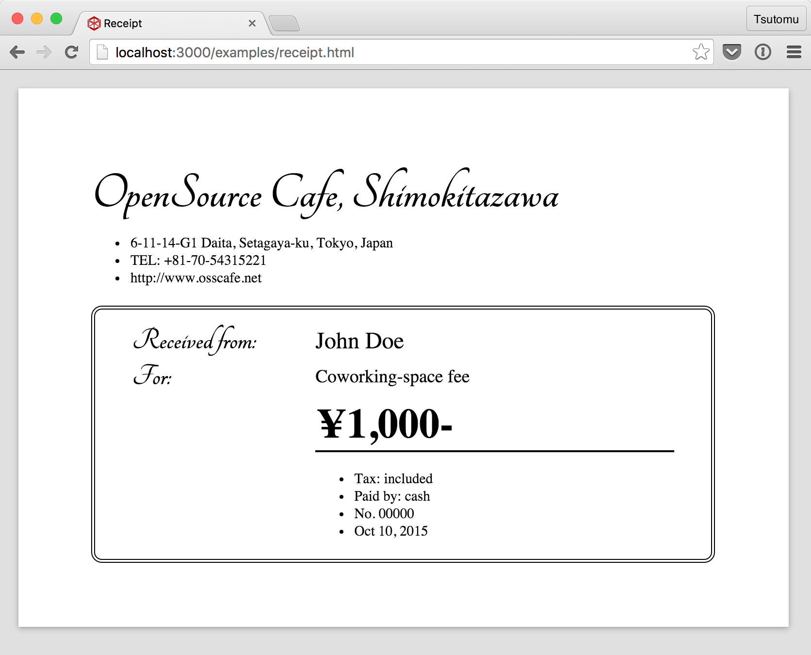
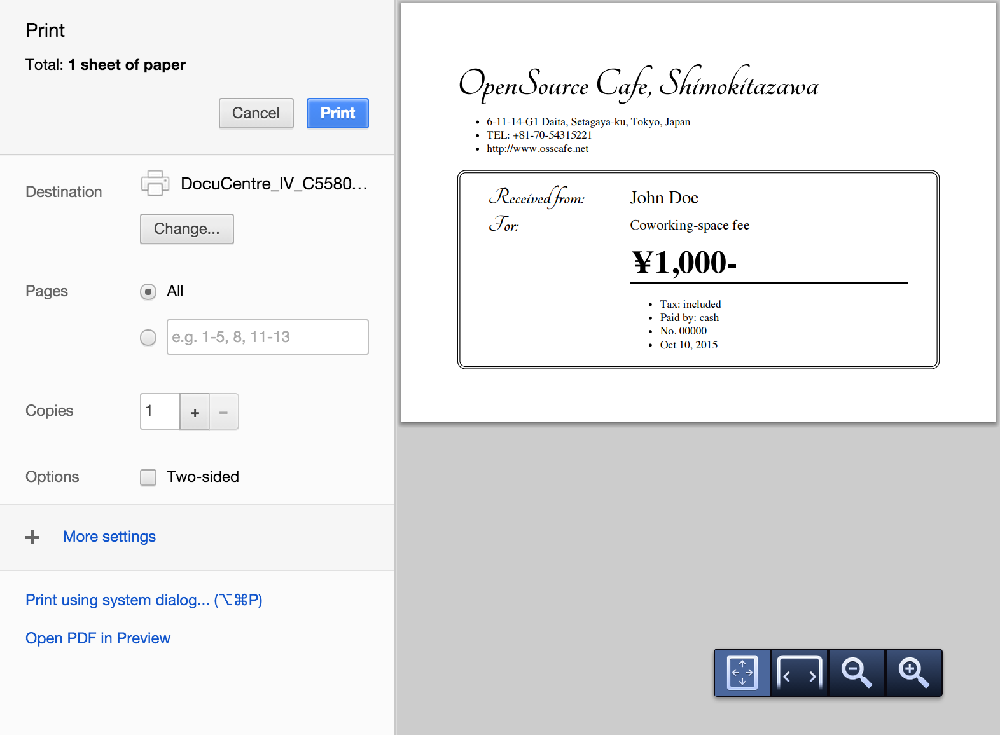
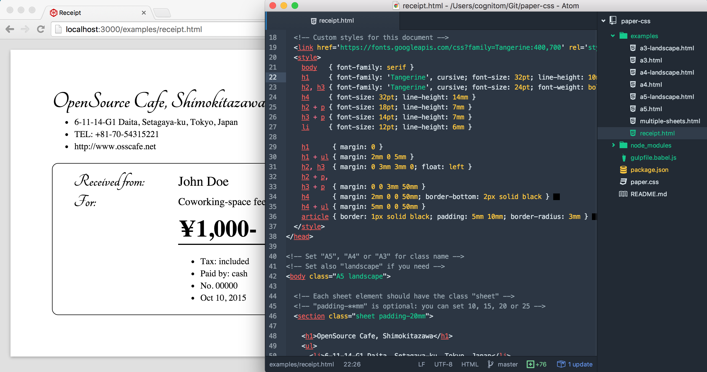

# Paper CSS for happy printing

[](https://cdnjs.com/libraries/paper-css)

> Front-end printing solution - previewable and live-reloadable!

Recently, we say "front-end" every day. Then why don't we make the printing documents in front-end? We believe we can make it perfectly without back-end. Paper CSS is just [a small snippet of CSS](https://raw.githubusercontent.com/cognitom/paper-css/master/paper.css), but it helps us create them in browser easily.

## Table of Contents

- [Installation](#installation)
- [Basic Usage](#basic-usage)
- [Live Preview](#live-preview)
- [PDF Generation](#pdf-generation)
- Why Paper CSS?
  - [Previewable](#previewable)
  - [Live-reloading](#live-reloading)
  - [Comparisons](#comparisons)
- [License](#license)

## Installation

Get Paper CSS from [cdnjs](https://cdnjs.com/libraries/paper-css) (recommended):

```html
<link rel="stylesheet" href="https://cdnjs.cloudflare.com/ajax/libs/paper-css/0.3.0/paper.css">
```

Or download [paper.css](https://raw.githubusercontent.com/cognitom/paper-css/master/paper.css) file from GitHub manually, or via npm:

```bash
$ npm install paper-css
```

## Basic Usage

Load paper-css into `<head>` like this:

```html
<!-- Load paper.css for happy printing -->
<link rel="stylesheet" href="dist/paper.css">

<!-- Set page size here: A5, A4 or A3 -->
<!-- Set also "landscape" if you need -->
<style>@page { size: A5 }</style>
```

Set the class of `<body>` and also set "sheet" for each sheet.

```html
<!-- Set "A5", "A4" or "A3" for class name -->
<!-- Set also "landscape" if you need -->
<body class="A5">

  <!-- Each sheet element should have the class "sheet" -->
  <!-- "padding-**mm" is optional: you can set 10, 15, 20 or 25 -->
  <section class="sheet padding-10mm">

    <!-- Write HTML just like a web page -->
    <article>This is an A5 document.</article>

  </section>

</body>
```

All available page sizes is listed below:

- A5, A5 landscape
- A4, A4 landscape
- A3, A3 landscape
- letter, letter landscape
- legal, legal landscape

See also [the examples](examples/) for detail.

## Live Preview

Install [live-server](https://github.com/tapio/live-server):

```bash
$ npm install --global live-server
```

Then, preview your HTML file:

```bash
$ live-server your-document.html
```

Your browser will open the document. And the browser will automatically reload the page when changes are detected.

See more detail and all options [here](https://github.com/tapio/live-server#usage-from-command-line).

## PDF Generation

Install [electron-pdf](https://github.com/fraserxu/electron-pdf):

```bash
$ npm install --global electron-pdf
```

Then, generate a PDF file from your HTML file:

```bash
$ electron-pdf your-document.html your-document.pdf
```

See more details and all options [here](https://github.com/fraserxu/electron-pdf#all-available-options).

**Note**: we used to provide a small CLI tool `paper-css` while `v0.2.x`, we've dropped it in favor of `electron-pdf` which is a better option to do the same, basically.

## Why Paper CSS?

### Previewable

You can check the design and layout before printing. See the browser like when you build a web page.



[This example](examples/receipt.html) could be printed like this.



### Live-reloading

It's just HTML/CSS, so we can edit it with live-reloading. See [Live Preview](#live-preview) section above.



### Comparisons

type | expression | learning cost | editable | in-browser | multipage
:-- | :-- | :-- | :-- | :-- | :--
HTML | Enough | already known | No | OK | ~100 pages \*
SVG | Enough | not so difficult | No | OK |
PDF | Perfect | difficult | No | NG | no limit \*\*
Excel | Not cool | *sigh* | Yes | NG | uncontrollable

\* It depends on user's environment. \*\* Only if you have huge memory on the server.

## License

MIT © Tsutomu Kawamura
